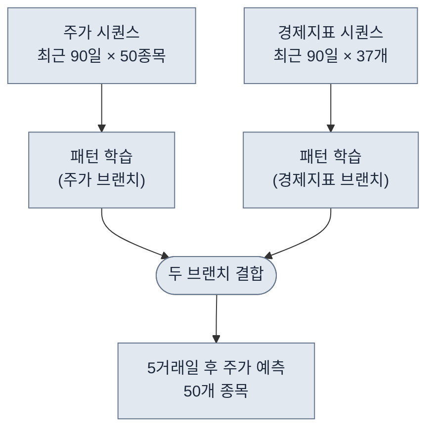
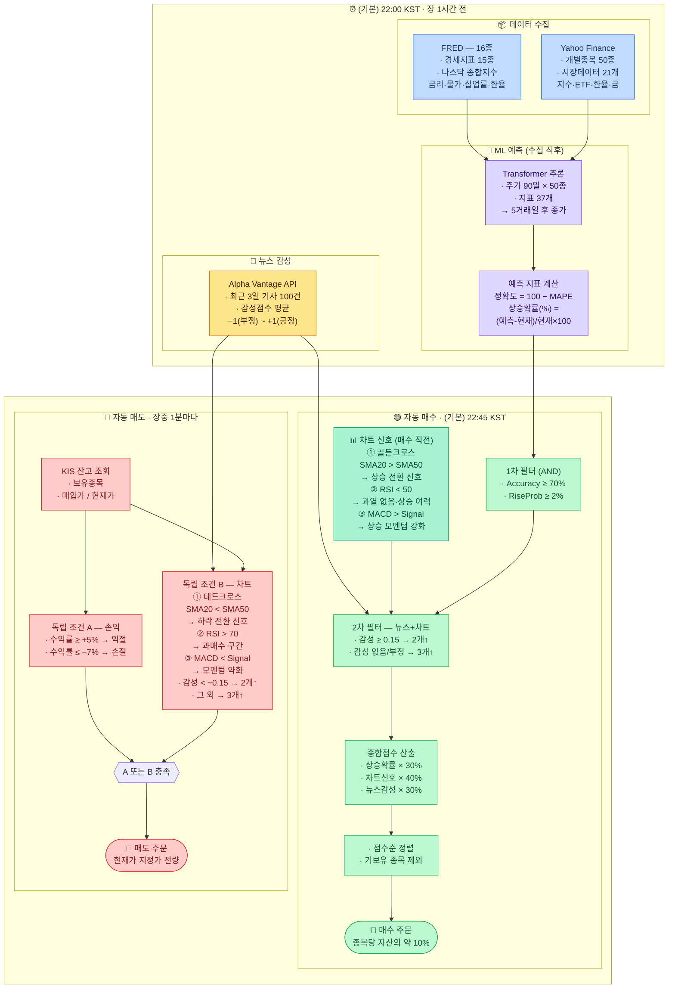

# 미국 주식 자동매매 시스템

딥러닝 모델로 주가를 예측하고, 차트 지표와 뉴스 감성을 규칙에 대입해 미국 주식을 자동으로 매매하는 퀀트 트레이딩 시스템

> 현재는 LLM을 사용하지 않고, 아래 두 가지 방식을 사용함.
> - **ML 모델 기반**: 과거 데이터를 학습한 Transformer 딥러닝 모델이 주가를 예측
> - **규칙 기반**: RSI·MACD 같은 차트 지표와 뉴스 감성 점수를 사전에 정의된 조건에 대입해 매수·매도를 결정

---

## 목차

1. [AI 예측 모델](#ai-예측-모델)
2. [전체 흐름](#전체-흐름)
3. [매매 대상 종목 (50개)](#매매-대상-종목-50개)
4. [데이터 수집](#데이터-수집)
5. [뉴스 감성 분석](#뉴스-감성-분석)
6. [증권사 연결 (KIS)](#증권사-연결-kis)
7. [매수 조건](#매수-조건)
8. [매도 조건](#매도-조건)
9. [스케줄링](#스케줄링)

---

## AI 예측 모델

### 목표

타겟 50개 종목의 **5거래일 후 종가**를 예측하는 멀티아웃풋 회귀
> 타겟 50개 종목 : 나스닥 100 종목 중, 시가총액 기준 상위 50개

| 구분 | 내용 |
|------|------|
| 입력 A | 타겟 50개 종목의 최근 90일 종가 시퀀스 |
| 입력 B | 거시·시장·환율·원자재 경제지표 시퀀스 (37개)<br/>· FRED 16개 — 경제지표 15개 + 나스닥 종합지수<br/>· Yahoo Finance 시장데이터 21개 — 지수·ETF·글로벌지수·달러인덱스·환율·금 |
| 출력 | 50개 종목 각각의 5거래일 후 종가 (벡터 50개) |

### 왜 5거래일(1주일) 후인가

| 구간 | 문제 |
|------|------|
| **1일 후** | 하루 단위 주가는 돌발 뉴스·시장 분위기에 너무 민감하게 반응해 패턴을 찾기 어렵다 |
| **30일 후** | 한 달 뒤는 그 사이에 실적 발표·금리 변화 등 예측 불가능한 일이 너무 많이 생긴다 |
| **5거래일** | 하루치 잡음은 걸러지고, 최근 주가·경제 흐름의 패턴은 아직 유효한 딱 적당한 구간 |

**다음 주 금요일 수익률**을 기준이기 때문에 — 일요일에 모델을 학습하면 예측 기간이 정확히 1주일과 맞아떨어지도록 의도적으로 설계한 부분도 있음 (전략)

### 모델 구조 — 2-Branch Transformer

- **전체 구조**: 2-브랜치 Transformer — 주가 브랜치 / 경제지표 브랜치를 독립적으로 인코딩한 뒤 합산
- **브랜치 구성**: 각 브랜치는 `Transformer 인코더 스택 → Dense → 특징벡터` 순으로 연결
- **Multi-Head Attention**: 시퀀스 내 각 시점 간의 상관관계를 학습 — 90일 중 어느 시점이 예측에 중요한지 스스로 파악
- **Feed-Forward Network (FFN)**: Attention 출력을 비선형 변환으로 정제
- **Fusion**: 두 브랜치의 특징벡터를 Add로 결합 → `Dense(128)`로 통합 표현 학습
- **Dropout**: 과적합 방지를 위해 Fusion 이후 적용
- **GlobalAveragePooling**: 시퀀스 전체를 고정 크기 벡터로 압축
- **출력층**: `Dense(50)` — 50개 종목 각각의 5거래일 후 종가를 동시에 회귀 예측



### 학습 설정

- **학습 방식**: 슬라이딩 윈도우 — 90일치 데이터로 5거래일 후 주가를 맞히는 방식으로 반복 학습
- **학습 샘플 수**: 7,295개 (전체 데이터에서 90+5거래일 제외)
- **검증셋**: 최근 30거래일을 분리해 과적합 여부 확인
- **학습 설정**: 최대 50 에포크, 배치 32, 학습률 0.0001 (성능 개선 없으면 조기 종료)
- **모델 파일 크기**: 약 8.5 MB

---

## 전체 흐름



> **매수 ↔ 매도 연계**: 매수 주문이 체결되면 KIS 잔고가 갱신되고, 장중 매도 루프는 이 잔고를 조회해 조건을 판단한다. (다이어그램에서 좌·우로 나란히 보이도록 엣지로는 연결하지 않음)

### 용어 정리

| 용어 | 설명 |
|------|------|
| **SMA**<br/>Simple Moving Average<br/>단순 이동평균 | 최근 N일간의 종가를 평균 낸 값을 날짜별로 이어 그린 선이다.<br/>예를 들어 20일 SMA는 오늘 포함 최근 20일 종가의 평균. 주가가 이 선 위에 있으면 최근 흐름이 좋다는 뜻이고, 아래에 있으면 흐름이 꺾였다는 신호다.<br/>→ "지금 주가가 평균보다 위에 있나, 아래에 있나"를 한눈에 보는 선 |
| **EMA**<br/>Exponential Moving Average<br/>지수 이동평균 | SMA처럼 평균선이지만, 오래된 날보다 **최근 날짜에 더 높은 가중치**를 둔다.<br/>그래서 최근 가격 변화에 더 빠르게 반응한다. MACD를 계산할 때 사용된다.<br/>→ "최근 움직임에 더 민감한 평균선" |
| **골든 크로스**<br/>Golden Cross | 단기 이동평균선(SMA 20일)이 장기 이동평균선(SMA 50일)을 **아래에서 위로 돌파**하는 순간.<br/>단기 흐름이 장기 흐름보다 좋아졌다는 뜻으로, 상승 추세로 전환됐다고 본다.<br/>→ "최근 주가가 살아나기 시작했다"는 신호. 이 시스템에서 가장 강한 매수 신호(가중치 1.5배) |
| **데드 크로스**<br/>Dead Cross | 단기 이동평균선(SMA 20일)이 장기 이동평균선(SMA 50일)을 **위에서 아래로 이탈**하는 순간.<br/>최근 주가 흐름이 나빠졌다는 뜻으로, 하락 추세로 전환됐다고 본다.<br/>→ "최근 주가가 꺾이기 시작했다"는 신호. 매도 조건으로 사용 |
| **RSI**<br/>Relative Strength Index<br/>상대강도지수 | 최근 14일간 오른 날의 힘과 내린 날의 힘을 비교해 0~100 사이 숫자로 나타낸 지표.<br/>→ "주가가 얼마나 달아올랐는지" 보여주는 온도계<br/><br/>**왜 70 이상이면 매도?**<br/>최근 14일 동안 거의 매일 올랐다는 뜻. 살 사람은 이미 다 샀고 더 올릴 구매자가 부족해 조정(하락) 가능성이 높다 → **과매수 구간**, 고무줄을 너무 당긴 상태<br/><br/>**왜 50 미만이면 매수?**<br/>오르는 힘과 내리는 힘이 비슷하거나 내리는 힘이 약간 우세한 상태. 아직 과열되지 않아 **더 오를 여지**가 있다 (일반적 과매도 기준은 30이지만, 이 시스템은 보수적으로 50을 기준으로 씀)<br/><br/>- **70 이상**: 과열 → 매도 신호<br/>- **50 미만**: 여유 있음 → 매수 신호<br/>- **30 이하**: 너무 많이 내려 반등 가능성 높음 |
| **MACD**<br/>Moving Average Convergence Divergence | **MACD = 단기 EMA(12일) − 장기 EMA(26일)**<br/>→ "최근 12일 평균 주가"에서 "최근 26일 평균 주가"를 뺀 값<br/><br/>**직관적 이해: 속도계**<br/>MACD는 주가 상승의 **가속/감속**을 보는 지표다.<br/>- MACD > 0 : 단기 평균이 장기 평균보다 높음 → 최근 상승 중<br/>- MACD < 0 : 단기 평균이 장기 평균보다 낮음 → 최근 하락 중<br/><br/>**Signal선** = MACD의 9일 EMA (MACD 값 자체의 평균선)<br/>→ Signal은 "최근 MACD의 평균 속도"<br/><br/>**왜 MACD > Signal이면 매수?**<br/>현재 속도(MACD)가 평균 속도(Signal)보다 빠르다 = **지금 가속 중**<br/>→ 상승 모멘텀이 강해지는 타이밍 → 매수 신호<br/><br/>**왜 MACD < Signal이면 매도?**<br/>현재 속도(MACD)가 평균 속도(Signal)보다 느리다 = **지금 감속 중**<br/>→ 오르던 힘이 약해지는 타이밍 → 매도 신호<br/><br/>비유: 차가 달리고 있어도 브레이크를 밟기 시작하면 곧 속도가 줄어든다. MACD는 그 브레이크를 밟는 순간을 포착하는 것 |
| **MAPE**<br/>Mean Absolute Percentage Error<br/>평균 절대 백분율 오차 | AI 모델이 과거에 예측한 값과 실제 값이 평균적으로 얼마나 차이났는지를 %로 나타낸 수치.<br/>예를 들어 MAPE가 5%라면 "평균적으로 실제 주가의 5% 범위 안에서 맞췄다"는 뜻이다.<br/>→ 낮을수록 예측이 정확한 모델 |
| **Accuracy (%)**<br/>예측 정확도 | `100 − MAPE`로 계산. MAPE가 낮을수록 Accuracy는 높다.<br/>예를 들어 MAPE 8% → Accuracy 92%.<br/>이 시스템에서는 **Accuracy 70% 이상**인 종목만 매수 후보로 올린다.<br/>→ "AI가 이 종목을 얼마나 잘 맞히고 있는지"를 나타내는 신뢰도 점수 |
| **Rise Probability (%)**<br/>상승 확률 | AI가 예측한 5거래일 후 종가와 현재가를 비교해 상승 여지를 %로 계산한 값.<br/>`(예측가 − 현재가) / 현재가 × 100`<br/>양수면 AI가 "5일 뒤 오를 것"으로, 음수면 "내릴 것"으로 예측했다는 뜻이다.<br/>이 시스템에서는 **2% 이상**인 종목만 매수 후보로 올린다.<br/>→ "AI가 이 종목이 얼마나 오를 것으로 보는지"를 나타내는 기대 수익률 |
| **뉴스 감성 점수**<br/>Sentiment Score | 해당 종목에 대한 최근 뉴스 기사들의 논조를 −1 ~ +1 사이 숫자로 요약한 값.<br/>- **+1에 가까울수록**: 호재·긍정적인 뉴스가 많음 (실적 호조, 신제품 출시 등)<br/>- **0 근처**: 중립적인 뉴스가 많거나 긍정·부정이 섞인 상태<br/>- **−1에 가까울수록**: 악재·부정적인 뉴스가 많음 (소송, 실적 악화 등)<br/>이 시스템에서는 ±0.15를 기준으로 긍정/중립/부정을 나눈다.<br/>→ "뉴스 분위기가 이 종목에 우호적인가"를 수치로 보는 지표 |
| **익절 / 손절**<br/>Take Profit / Stop Loss | **익절**: 목표 수익률에 도달했을 때 팔아서 이익을 확정하는 것. 더 오를 수도 있지만 확실한 수익을 챙기기 위해 매도.<br/>**손절**: 손실이 일정 수준을 넘으면 더 큰 손해를 막기 위해 파는 것. 아프지만 늦게 팔수록 손해가 커지기 때문에 미리 정해둔 선에서 자른다.<br/>이 시스템 기준: 수익률 **+5% → 익절**, **−7% → 손절**<br/>→ 자동으로 수익을 챙기고 손실을 제한하는 안전장치 |
| **지정가 주문**<br/>Limit Order | 내가 원하는 가격을 미리 정해서 주문하는 방식. 그 가격이 되어야 체결된다.<br/>이 시스템은 현재가를 지정가로 입력해 최대한 빠르게 체결되도록 한다.<br/>반대 개념인 **시장가 주문**은 가격 상관없이 즉시 체결되지만 불리한 가격에 체결될 수 있다.<br/>→ "이 가격에 사겠다/팔겠다"고 지정해서 주문하는 방식 |
| **장중**<br/>Market Hours | 미국 주식 거래소가 실제로 열려 있어 주식을 사고팔 수 있는 시간대.<br/>한국 시간 기준으로 **밤 10시 30분 ~ 새벽 5시** (서머타임 적용 시).<br/>서머타임이 없는 겨울에는 **밤 11시 30분 ~ 새벽 6시**.<br/>이 시스템의 자동 매도는 장중에만 실행된다.<br/>→ 미국 증권 거래소가 문을 열고 있는 시간 |

---

## 스케줄링

스케줄 시간은 **코드 기본값**이 있지만, 실제 실행 환경에서는 **환경변수(또는 배포 설정)**로 값이 바뀔 수 있다.
따라서 “문서에 적힌 시간”과 “지금 서버가 실제로 도는 시간”이 다르면, 아래 API로 현재값을 확인하는 것이 가장 정확하다.

### 기본값(코드 기준)

`app/core/config.py`의 기본값은 다음과 같다.

- **경제 데이터 수집**: `SCHEDULE_ECONOMIC_UPDATE_TIME` = `22:00` (KST)
- **자동 매수**: `SCHEDULE_AUTO_BUY_TIME` = `23:00` (KST)
- **자동 매도 체크**: `SCHEDULE_AUTO_SELL_INTERVAL_MIN` = `3` (분) — 단, 코드는 **미국 장중에만** 의미 있는 처리를 수행
- **EOD LLM 리포트**: `SCHEDULE_EOD_LLM_REPORT_TIME_KST` = `07:00` (KST)
- **추론/감성**:
  - 추론은 “고정 시각”이 아니라, **경제 데이터 수집 후 신규 행이 있을 때** `SCHEDULE_AFTER_ECONOMIC_RUN_INFERENCE=true`이면 뒤따라 실행된다.
  - 감성은 경제 데이터 수집 흐름 안에서, **오늘(KST) 감성 데이터가 없을 때만** 실행된다(이미 있으면 스킵).

### 현재 서버의 실제 스케줄 확인(권장)

- **전체 스케줄 오버뷰**: `GET /admin/health` → `schedules` 필드
- **매수/매도 스케줄 상태**: `GET /stocks/recommendations/scheduler/status`
- **감성 적재 상태**: `GET /stocks/recommendations/sentiment/status`
- **추론 완료 상태**: `GET /admin/inference/status`

## 매매 대상 종목 (50개)

나스닥 100 지수 편입 종목 중 시가총액 상위 50개를 선정했다. 유동성이 높고 시장 대표성이 있는 대형주 위주로 구성되어 있다.

| 섹터 | 종목 |
|------|------|
| 반도체 | 엔비디아, 브로드컴, 마이크론, AMD, ASML, 인텔, 램리서치, 어플라이드 머티리얼즈, 텍사스 인스트루먼트, KLA Corp, Arm, 아나로그디바이스, 샌디스크, 퀄컴, 마벨 테크놀로지 |
| 빅테크 | 애플, 마이크로소프트, 아마존, 구글, 메타, 테슬라 |
| 소프트웨어·플랫폼 | 넷플릭스, 팔란티어, 쇼피파이, 앱러빈, 팔로알토 네트웍스, 인튜이트, 어도비, 케이던스, 시놉시스 |
| 통신·네트워크 | 시스코, 티모바일, 컴캐스트 |
| 소비재·유통 | 월마트, 코스트코, 스타벅스, 메르카도리브레, 몬델리즈 |
| 헬스케어·바이오 | 암젠, 인튜이티브 서지컬, 버텍스 파마슈티컬스 |
| 기타 | 린드, 펩시코, 씨게이트, 허니웰 인터내셔널, 부킹홀딩스, 콘스텔레이션 에너지, ADP, 에어비앤비, 메리어트 |

---

## 데이터 수집

기본 동작은 매일 **22:00(KST)**에 두 곳에서 데이터를 가져온다.

단, 실제 운영에서는 환경변수/설정으로 스케줄 시간이 바뀔 수 있다. (아래 “스케줄링” 참고)

### 미국 경제 지표 — FRED

> **사이트**: https://fred.stlouisfed.org

> 미국 연방준비제도(Fed)가 운영하는 공식 경제 데이터 플랫폼. 금리·물가·실업률 등 미국 거시경제 지표를 무료로 제공한다.

미국 거시경제 상황을 나타내는 지표 16종을 수집한다 (경제지표 15개 + 나스닥 종합지수 1개).
> 글로벌 지수는 FRED가 아니라 Yahoo Finance에서 별도로 수집한다. 단, 나스닥 종합지수(NASDAQCOM)는 예외적으로 FRED에서 수집한다.
> 달러 환율도 FRED(`DTWEXM` 무역가중평균달러지수)와 Yahoo Finance(`달러 인덱스` ICE·`달러/엔`·`달러/위안`)가 각각 다른 기준으로 수집한다.

| 지표 | 의미 |
|------|------|
| 기준금리 | 미국 중앙은행이 설정하는 이자율 |
| 2년 만기 국채 수익률 | 단기 시장 금리 수준 |
| 10년 만기 국채 수익률 | 장기 시장 금리 수준 |
| 장단기 금리차 | 10년−2년 국채 금리 차이 (경기 침체 선행 지표) |
| 소비자 물가지수 (CPI) | 물가 상승률 |
| 10년 기대 인플레이션율 | 시장이 예상하는 향후 10년 평균 인플레이션 |
| 개인 소비 지출 (PCE) | 가계 소비 동향 |
| 실업률 | 일자리를 못 찾는 사람 비율 |
| 소비자 심리지수 | 사람들이 경기를 어떻게 느끼는지 |
| GDP 성장률 | 경제가 얼마나 성장했는지 |
| 달러 무역가중환율 | 주요 교역국 통화 대비 달러 강도 (여러 통화 평균) |
| 통화량 M2 | 시중에 풀린 돈의 양 |
| 금융 스트레스 지수 | 금융 시장의 불안 정도 |
| 5년 변동금리 모기지 | 주택 담보 대출 금리 |
| 가계 부채 비율 | 가계의 채무 부담 |
| 나스닥 종합지수 | 나스닥 전체 시장 지수 (FRED NASDAQCOM, 일간) |

### 주가 및 시장 데이터 — Yahoo Finance

> **사이트**: https://finance.yahoo.com

> 전 세계 주식·지수·ETF·환율 데이터를 무료로 제공하는 금융 정보 플랫폼. 개별 종목의 일별 가격 히스토리를 가져오는 데 사용한다.

개별 주식과 시장 전반의 흐름을 파악하기 위한 데이터를 수집한다.

| 분류 | 항목 |
|------|------|
| 개별 주식 (50개) | 나스닥 100 시총 상위 50종목 (매매 대상과 동일) |
| 미국 지수 (5개) | S&P 500, 나스닥 100, 다우존스, VIX (공포지수), 러셀 2000 |
| 미국 ETF (6개) | SPY, QQQ, 채권 ETF, TIPS, 투자등급 회사채, 리츠 |
| 글로벌 지수 (6개) | 일본 닛케이, 중국 상해, 홍콩 항셍, 영국 FTSE, 독일 DAX, 프랑스 CAC 40 |
| 외환·원자재 (4개) | 달러/엔, 달러/위안, 달러 인덱스, 금 가격 |

> 개별 주식(50개) **제외**: 총 21개 (미국 지수 5 + 미국 ETF 6 + 글로벌 지수 6 + 외환·원자재 4)  
> 개별 주식(50개) **포함**: 총 71개

---

## 뉴스 감성 분석

### 데이터 출처 — Alpha Vantage

> **사이트**: https://www.alphavantage.co

금융 데이터 전문 플랫폼으로, 주식 가격뿐 아니라 뉴스 기사의 감성을 분석한 점수를 API로 제공한다. `NEWS_SENTIMENT` 엔드포인트를 사용하면 특정 종목(ticker)에 대한 최신 뉴스 기사와 함께 기사별 감성 점수를 바로 받을 수 있다.

- 무료 플랜 존재 (분당 요청 수 제한 있음) → API 키를 여러 개 발급해 병렬 처리로 속도 보완
- 수집 기준: 최근 3일 이내 기사, 최대 100건 (`limit=100`)
- 종목과의 관련성(`relevance_score`)이 낮은 기사는 자동 제외

### 감성 점수 계산

각 기사에는 해당 종목에 대한 `ticker_sentiment_score`가 −1 ~ +1 범위로 붙어 있다. 이 점수들을 평균 내어 종목 하나당 대표 감성 점수를 산출한다.

**−1 ~ +1 구간을 어떻게 읽나 (부가 설명)**  
값은 “기사 속 **문장 단위 감성**을 종목에 매겨 요약한 뒤, 여러 기사를 **평균**한 것”이라서 **한 축(스펙트럼) 위의 연속 지표**로 보면 된다.

- **+1 에 가까울수록**: 해당 티커를 두고 **실적 호조, 성장, 긍정적 전망** 등 **좋은 쪽 논조**가 기사 톤에 더 많이 실린다고 API가 요약한 것.
- **0 에 가까울수록**: **중립 보도**이거나, 긍정·부정 문장이 **섞였거나** 극단으로 치우치지 않은 상태.
- **−1 에 가까울수록**: **실적 우려, 소송·규제, 하향, 부정 헤드라인**처럼 **나쁜 쪽 논조**가 상대적으로 두드러진다고 요약된 것.

절대 “주가가 몇 퍼 오른다”는 뜻이 아니고, **뉴스 텍스트의 평균적인 긍·부정 방향**을 숫자로 나타낸 것이다. 같은 날이라도 기사 표본·제목 과장도에 따라 수치만 보고 과신하면 안 된다.

| 점수 범위 | 의미 | 매매 영향 |
|-----------|------|-----------|
| +0.15 이상 | 긍정적 뉴스 우세 | 매수 시 차트신호 기준 완화 가능 |
| −0.15 ~ +0.15 | 중립 | 차트신호 기준 강화 |
| −0.15 미만 | 부정적 뉴스 우세 | 보유 중이면 매도 후보 검토 |
| 데이터 없음 | 뉴스 수집 실패 또는 기사 없음 | 감성 조건 제외, 차트신호만으로 판단 |

---

## 증권사 연결 (KIS)

한국투자증권 API를 통해 실제 주문을 낸다.

- **모의투자 / 실전투자** 전환 가능 (`.env` 파일에서 설정)
- 로그인 토큰은 자동으로 발급·갱신된다 (약 24시간마다)
- 지원 거래소: 나스닥, 뉴욕증권거래소(NYSE), 아멕스(AMEX)

---

## 매수 조건

3단계를 모두 통과한 종목만 매수한다.

### 1단계: AI 예측 통과

```
AI 정확도 ≥ 70%  AND  상승 확률 ≥ 2%
```

AI가 자신 있게 오를 것이라고 예측한 종목만 통과.

### 2단계: 차트 신호 확인

차트 분석 지표 3가지 중 1개 이상 충족해야 한다.

| 지표 | 매수 신호 | 의미 |
|------|---------|------|
| 골든 크로스 | 단기 평균 > 장기 평균 | 최근 주가 흐름이 살아나고 있음 |
| RSI | RSI < 50 | 아직 과열되지 않은 상태 |
| MACD | MACD > 시그널 라인 | 상승 모멘텀이 생기는 시점 |

> **용어 설명**: 이동평균은 일정 기간의 평균 주가를 이은 선이다. 단기(20일)가 장기(50일)를 위로 돌파하면 "골든 크로스"라 부르며 상승 신호로 본다.

### 3단계: 뉴스 + 차트 종합

- 뉴스 감성이 좋은 경우(점수 ≥ 0.15): 차트 신호 2개 이상
- 뉴스 감성이 중립/부정인 경우(점수 < 0.15) 또는 데이터 없음: 차트 신호 3개 이상

> 코드 기준: 매수 판단에서 뉴스 감성은 “필수 게이트”가 아니다.  
> - 감성 ≥ 0.15면 “긍정 감성”으로 분류되어(있는 경우) 차트 기준(≥2)을 적용하고, 종합 점수에 반영된다.  
> - 감성 데이터가 없거나 감성 < 0.15면 “감성 미충족/없음”으로 취급되어 차트 기준을 더 강화(≥3)한다.

통과한 종목은 아래 공식으로 점수를 계산해 높은 순으로 매수한다.

```
종합 점수 = (AI 상승 확률 × 30%) + (차트 신호 강도 × 40%) + (뉴스 점수 × 30%)
```

### 매수 수량 — 금액 기반

고정 수량 대신 **종목당 고정 금액($25,000)**으로 매수 수량을 결정한다.

```
매수 금액 = 총 자산의 약 10% (종목당 고정)
매수 수량 = floor(매수금액 / 현재가)   (최소 1주)
```

| 항목 | 값 |
|------|-----|
| 종목당 매수 비율 | 자산의 약 10% ($35,000) |
| 일평균 통과 종목 수 | 약 6개 |
| 일 평균 총 운용 비율 | 약 59% (6종목 기준) |
| 전 종목 손절 시 최대 손실 | 자산의 약 4.1% |

---

## 매도 조건

보유 중인 종목에 대해 1분마다 아래 조건을 확인한다. 하나라도 해당되면 전량 매도한다.

### 조건 1: 수익/손실 기준

```
+5% 이상 수익  →  익절 (이익 실현)
-7% 이상 손실  →  손절 (손실 방어)
```

### 조건 2: 나쁜 뉴스 + 차트 악화

```
뉴스 감성 점수 < -0.15  AND  차트 매도 신호 2개 이상
```

### 조건 3: 차트 전반 악화

```
차트 매도 신호 3개 모두 충족
```

### 매도 판단 규칙(우선순위/예외)

- **OR 조건**: 위 3개 조건 중 **하나라도** 충족하면 매도 후보로 분류된다. (조건이 여러 개 동시에 충족될 수 있으며, 이 경우 `sell_reasons`에 모두 기록)
- **감성 데이터가 없으면**: 뉴스 감성 점수가 없을 때는 “조건 2”를 평가할 수 없으므로, **차트 매도 신호 3개 이상**이면 매도 후보가 될 수 있다. (기본값: `SELL_TECH_MIN_WITHOUT_SENTIMENT=3`)
- **데이터 소스**
  - **수익/손실(변동률)**: KIS 잔고의 `평균매입가(pchs_avg_pric)`와 `현재가(now_pric2)`로 계산
  - **차트 신호**: Supabase `stock_recommendations`의 **종목별 최신 1행**(골든 크로스/RSI/MACD)
  - **뉴스 감성**: Supabase `ticker_sentiment_analysis.average_sentiment_score`
- **처리 순서**: 매도 후보는 **변동률 절대값이 큰 종목부터** 처리한다.
- **주문 방식**: 자동 매도는 기본적으로 **전량 지정가 주문(현재가로 지정)**을 사용한다. (주문 성공/실패 및 사유는 로그/일일 주문 히스토리에 남는다)

**차트 매도 신호 3가지**

| 신호 | 조건 | 의미 |
|------|------|------|
| 데드 크로스 | 단기 평균 < 장기 평균 | 주가 흐름이 하락 전환 |
| RSI 과매수 | RSI > 70 | 주가가 너무 많이 올라 조정 가능성 |
| MACD 매도 | MACD < 시그널 라인 | 상승 모멘텀 소진 |